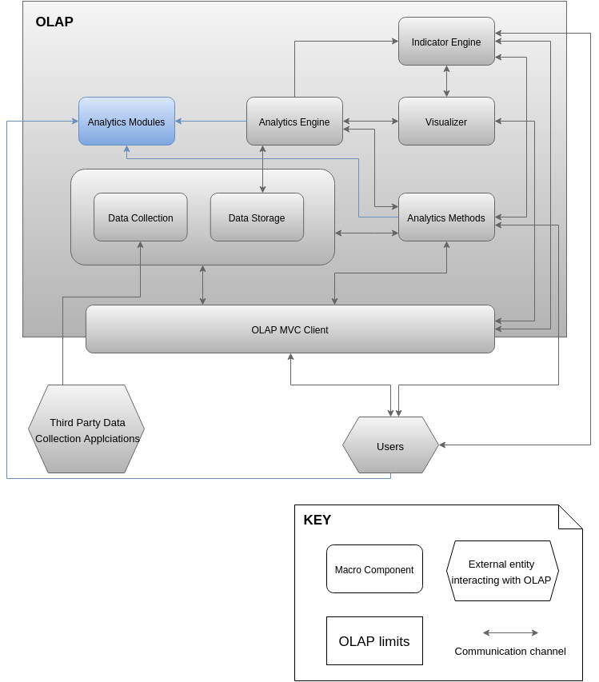

# ANALYTICS METHODS: MODULE VIEWS

## Primary Presentation

## Element Catalog

### Package controller
A controller package to hold the HTTP Restul endpoints for the Analytics Methods upload and modification.

* **AnalyticsMethodsUploadController**: This class will expose HTTP endpoints in a RESTFUL manner to upload, modify, and view Analytics Methods (specifically its metadata) as well as methods for retrieving configuration objects and validation of input. The upload, view and modification methods will be available to Researchers and Developers, while the view methods are available to other Users. The Analytics Engine will be able to directly access the Analytic Methods through another class.

### Package service

This package serves for giving logical services when uploading and modifying Analytics Methods. It allows for validation, checking input/output and listing. It also enables the Analytics Engine to instantiate Analytics Methods.

* **AnalyticsMethodsService**: This class provides services to upload, modify and view the AnalyticsMethodMetadata of the different methods. Allows for establishing a link with the AnalyticsMethodRepository and gives access to the Analytics Engine to the specific AbstractAnalyticsMethod instances (the actual implementation submitted by the developers and researchers). This is possible due to the fact that the Analytics Methods reside on the same Java Virtual Machine as the Analytics Engine.

* **AnalyticsMethodsValidator**: When the Researcher/Developer uploads a new Analytics Method, the uploaded Jar file is sent along a JSON object metadata about the Analytics Method as well as a class that extends the AbstractAnalyticsMethod. Additionally, when the Analytics Method uploaded is a Predictive Model, it must provide a PMML file (through the respective method of the Analytics Method) to enable the standardization of the method technique. This validator helper class allows to perform checks that there exists an appropriate AbstractAnalyticsMethod extension class and that the PMML is a valid file. It is used by the Service when an upload or modification of an Analytics Method occurs.

### Package dataAccess

A Data Access Layer for handling the Metadata of the Analytics Methods.

* **AnalyticsMethodsRepository**: This Repository enables a Data Access Layer for accessing the stored AnalyticsMethodMetadata necessary to locate and use the Analytics Methods.

### Package model

The main classes that represent the usage of the Analytics Methods framework. Provides classes for locate and hold metadata as well as classes for the actual implementation of the Analytics Methods.

* **AnalyticsMethodMetadata**: This class has the required data needed for the Controller to expose the main data of the Analytics Method such as name, creator, version, description and also provides a locator for the Service to instantiate the Implementation of the specific AbstractAnalyticsMethod that is used by the Analytics Engine. This data is stored in the database whenever an upload or modification is made over the Analytics Method into a Database through the Repository.

* **AnalyticsMethodInstance**: This is the class that Researchers and Developers must extend in order to create specific Analytics Methods. It has an `execute()` method that will be executed by the Analytics Engine. It also has methods to expose the input and output configuration (`getInutPorts()` and `getOutputPorts()`) and a method to instantiate the data of is input. This class must also implement a `validateInputConnfiguration(OLAPDataSet config)` in order to dynamically check that the configuration that is getting i a valid mapping of input to its ports. The class uses heavily the `OLAPdataSet` package that is common among the components that reside within the Java Virtual Machine that contains the Analytics Engine (Analytics Engine, Analytics Methods and Visualization Engine). The reason for this is to establish a common simple Data Object that can be translated into columns and easily serializable into JSON.

### Package OpenLAP-DataSet
This is a common package for the components that reside on the same JVM as the Analytics Engine. It allows the different macro components in it to have a common data object that is generic and compatible with table-like data. The model is simple but effective and requires minimum effort from researchers and developers to use.
* **OLAPDataSet**: This is a container for columns. It encapsulates a map between column names and the `OLAPDataColumn`s. When Researchers and Developers are creating new Analytics Methods or Visualizations they must use this data transfer object in order to allows dynamic type checking from the sources. The possible mappings are (Data from Indicator queries to Analytics Methods or Visualizations
* **OLAPDataColumn&#60;T&#62;**: This class represents a one dimensional column that is to be aggregated by the `OLAPDataSet`. It holds properties for type and array of the data. It also allows to verify that an input is valid for the specific column.
* **OLAPPortConfiguration**: This is a simple mapping between different columns. Its purpose is to support a dynamic checking for the input data from origin to the input port of the using classes. Different configurations can be: Input data form Indicators (Queries) to Analytics Methods or to Visualizations, Analytics Methods to Visualizations, Analytics Methods to other Analytics Methods.
* **OLAPDataColumnFactory**: A factory to create objects of type `OLAPDataColumn` depending on the types available on `<<Enum>>OLAPColumnDataTypes`.
* **&#60;&#60;Enum&#62;&#62;OLAPColumnDataTypes**: An enumerator to be used by the `OLAPDataColumnFactory`. Each entry represents valid column types.

## Context Diagram

## Variability Guide

* The `<<Abstract>>AbstractAnalyiticsMethod` is meant to be extended by new Analytics Methods that Researchers / Developers create. They will submit the code through the API exposed in the `AnalyticsMethodsUploadController` and the Analytics Engine will be able to execute the methods through the abstraction class.
* The classes described in the `OLAPdataSet` are meant to be used as data objects in the classes extending the `<<Abstract>>AbstractAnalyiticsMethod`. They will expose the data objects for configuration and validation through the Service (and transitively to the controller).

## Rationale

This macro component is designed to reside in the same runtime environment as the Analytics Engine, i.e. the same Java Virtual Machine. This allows not only quick direct access to the Analytics Methods whenever a request for processing is made, but also enables the possibility to easily add new Analytics Methods that comply with the Modularity Framework to be added in runtime and be handled by the Framework dynamically. Users that are Researchers or Developers are able to upload new  Analytics Methods via the endpoints exposed by the controller. This API enables them to plug in new techniques for analysis and submit them to the platform, which executes validation of the submitted work for compliance and then exposes the new Methods internally to make them available to the Analytics Engine. The submitted Analytics Methods are sent through Jar Files into the platform via the HTTP ports, where they are tested for compliance by the validator before made available.

The model of the platform is meant to hold abstractions for the Analytical Methods implementations. Users that are Researchers/Developers will extend the `<<Abstract>>AbstractAnalyticsMethod` class and implement the different methods and establish communication options for them to be accesses through the service to both the Controller for exposing the availability of methods, input and output validation and to the Analytics Engine to create instances and run the specific configurations. The data validation is performed through the use of the `OpenLAP-DataSet` package classes and allows to expose inputs as well as perform dynamic validation of the configurations.

Another key components is the `OpenLAP-DataSet` package, which is available to all the macro modules of the Analytics Engine runtime (also referred as the OpenLAP-Core) and enables the different components in it to transfer data in a two dimensional form. The reasons for establishing this data object are the following:
* An object for dynamic type checking is necessary since the outputs of Indicators and Analytics Methods must match the Inputs of other Analytics Methods and/or Visualizations.
* It is expected to be easy to implement by Developers and Researchers. and the guidelines for using when crating new Analytics Methods and/or Visualizations should be homogeneous and simple.
* Enables simple extension and allows Researchers/Developers to have flexibility on handling data internally in the Independent Analytics Methods / Visualizations.

## Related Views
* Section 4.5.2. describes the Component and Connector view in order to understand the overview of the dynamic behavior of the component.
* Section 4.2. describes the Analytics Engine, the main macro component that interacts and uses the Analytics Methods. It also uses the `OpenLAP-DataSet` in order to pass data to the Visualizer macro component and/or to concatenate Analytics Methods.
* Section 4.4. describes the Visualizer, a macro component that also interacts with the `OpenLAP-DataSet` package.
* Section 4.6 describes the Analytics Modules, which holds Triads that allow to save configurations between Indicators, Analytics Methods and Visualizations
