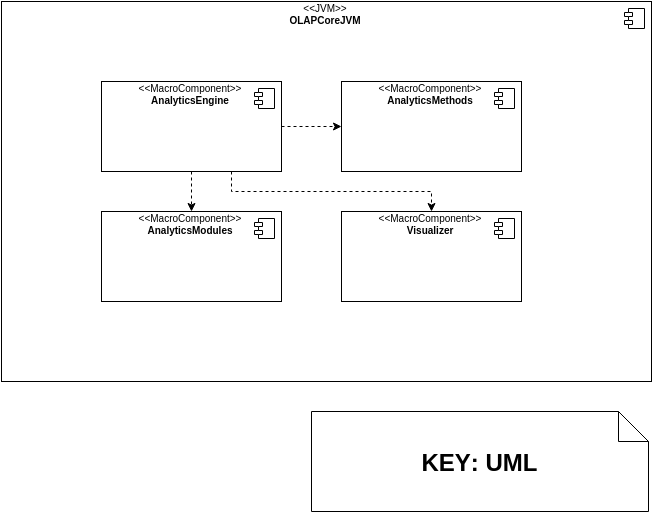

# ANALYTICS METHODS: COMPONENT AND CONNECTOR VIEWS

## Primary Presentation

## Element Catalog

### Components
* **&#60;&#60;database&#62;&#62; AnalyticsMethodsDataBase**: This is a database which holds the metadata associated to the uploaded Analytics Methods. The record get updated whenever the Analytics Methods are modified or deleted and is accessed through the `AnalyticsMethodRepository`.
* **&#60;&#60;repository&#62;&#62; AnalyticsMethodsRepository**: Whenever the Analytics Methods are updated or uploaded, the respective metadata is inserted to the `AnalyticsMethodsDataBase` through this repository. Other interaction with the database is also handled by this object.
* **AnalyticsMethodMetadata**: This object holds the metadata of the different uploaded Analytics Methods that the Developers and Researchers submit to the system. Is used to locate the executables as well as provide relevant information that gets exposed in the `AnalyticsMethodsController`.
* **AnalyticsMethodsService**: The main service of the macro module. It provides both services for the controller to expose the available Analytics Methods as well as submit new methods. Additionally enables the Analytics Engine macro module to access the Analytics Modules to use and get instances for use.
* **AnalyticsMethodsUploadValidator**: Whenever new Analytics Methods are submitted, the validator takes care of accessing the submitted `AnalyticsMethodBundle` jar file and checks that it includes an extension of the `<<Abstract>>AbstracAnalyticsMethod` as well as valid JSON description metadata and PMML files (if needed).
* **&#60;&#60;jarFile&#62;&#62; AnalyticsMethodBundle**: This is a JAR file that holds the binaries of the Analytics Method. It contains at least a class that extends the `<<Abstract>>AbstractAnalyiticsMethod` Class and is uploaded along with a JSON object that describes the metadata. The Analyitcs Method can provide a PMML file that can be checked by the validator. Additionally the Jar file can contain other needed classes for the internal implementation of the method. These components are checked for validity by the `AnalyticsMethodsUploadValidator` during submission and/or modification. The `AnalyticsMethodsService` then provides an API for the Analytics Engine macro component to interact with instances of the Analytics Method submitted in the file.
* **&#60;&#60;controller&#62;&#62; AnalyticsMethodsController**: This controller exposes a RESTful HTTP API with methods for uploading, modifying, and browsing Analytics Methods. It also exposes methods for checking the input ports of available Analytics Methods as well as their metadata. Ideally, the `OpenLAPWebClient` will provide a we interface for this controller, but the methods can be used with direct HTTP requests.
* **&#60;&#60;user&#62;&#62; Developer/Researcher**: The Developer/Researcher interacts with the Analytics Methods upload features through HTTP. The Methods can be used through he instantiation of indicators with the help of the Analyitcs Engine macro component.
* **&#60;&#60;macroComponent&#62;&#62; AnalyticsEngine**: The Analytics Engine can access instances of the Analytics Methods (classes extending of `<<Abstract>>AbstracAnalyticsMethod`) through the usage of the `AnalyticsMethodsService`.
* **&#60;&#60;macroComponent&#62;&#62; AnalyticsModules**: The Analytics Modules macro component stores the configuration of mappings between the outputs of Indicators, Analytics Methods and/or Visualizations in the Triads. This configuration is saved when the indicator is created and is used directly by the Analytics Engine whenever requests for that specific indicator are executed. The configuration is then used over instances of the Analytics Methods in order to analyze data form the Indicators.

### Connectors

* **HTTP**: Methods for the controller are accessed via HTTP or a browser. The controller exposes HTTP endpoints in order to support the design.
* **JPA**: JPA is used to access the Database.
* **AnalyticsMethodsDatabase &#60;&#60;contains&#62;&#62; AnalyticsMethodMetadata**: The stored items of the `AnalyticsMethodsDataBase` are mainly mappings of `AnalyticsMethodMetadata`.
* **AnalyticsMethodMetadata &#60;&#60;refers&#62;&#62; AnalyticsMethodBundle**: The `AnalyticsMethodMetadata` contains the reference and data about the `AnalyticsMethodBundle`, in particular description fields and location.
* **AnalyticsMethodBundle &#60;&#60;contains&#62;&#62; :AbstractAnalyticsMethod**: The bundles have the Instrances (classes that extend the `<<Abstract>>AbstractAnalyiticsMethod`) of the Analytics Methods.
* **:AbstractAnalyticsMethod &#60;&#60;contains&#62;&#62; OLAPPortConfiguration**: The Analytics Method instances must be able to process OLAPPortConfiguration for the Triads with and check that the output of the Indicator query is compatible with its own input.
* **AnalyticsMethodsUploadValidator &#60;&#60;validates&#62;&#62; AnalyticsMethodBundle**: The validator checks that the Bundle is compilant with the framework's minimum guidelines.
* **AnalyticsMethodsController &#60;&#60;uses&#62;&#62; AnalyticsMethodBundle**: The Bundle is submitted to the Controller via HTTP.
* **AnalyticsMethodsController &#60;&#60;uses&#62;&#62; OLAPPortConfiguration**: The controller uses the OLAPPortConfiguration of the Triad in order to dynamically check that the types of input/output are correct with the help of the instances of the Analytics Methods.
* **AnalyticsEngine &#60;&#60;uses&#62;&#62; OLAPPortConfiguration**: The Analytics Engine accesses the OLAPPortConfiguration stored in the Triads.
* **Developer/Researcher &#60;&#60;submits&#62;&#62; AnalyticsMethodBunle**: The Developer/Researcher submits the bundle Jar file through HTTP.
* **OpenLAPWebClient &#60;&#60;submits&#62;&#62; OLAPPortConfiguration**: The Client can interact with the endpoits exposed by the controller sending requests to process OLAPPortConfiguration for validation.

## Context Diagram

## Variability Guide

* The OLAPPortConfiguration are specified according to the specific implementaitons of the classes that extend the `<<Abstract>>AbstractAnalyiticsMethod`. The OLAPPortConfiguration denote both the input and the output of the specific Analytics Method. The input will be provided by the Analytics Engine and is the result of executing the query that the Indicator provides. The outputs will be sent to the Visualization specified on the Triad.
* The `<<Abstract>>AbstractAnalyiticsMethod` has methods that must be overriden by the implementations. The methods specify the implementation of the algorithm for execution as well as methods to inform the existence of and provide the PMML file if the implementer wishes to validate it. The implementations must also specify an `initialize(OLAPDataSet incomingData, OLAPPortConfiguration configuration)` method to initialize the inputs and forcing the implementation to use the passed configuration. The result of the execution of the main algorithm is stored on the Analytics Method output.

## Rationale

The Analytics Methods is a component that resides along the same Java Virtual Machine as the Analytics Engine. The reason behind this is that it allows a module to take care of the management of the Analytics Methods individually but at the same time gives direct access to the uploaded methods to the Analytics Engine.
The idea is that the Analytics Engine can access the Analytics Modules in a dynamic fashion through the service. The users can submit new Analytics Methods by implementing the framework and uploading them trough the endpoints. Then, the runtime canexecute the Analytis Methods once they are deemed correct for functioning. The framework guarantees minimum execution context in order to do so. Additionally, the framework provides means for type checking of the configurations that are submitted through the controller and then stored in the Analytics Modules macro component inside the respective Triads. This enables the Analytics Modules to run against configurations that can be checked at runtime and be decoupled from the specific data that is used.
The data about the Amalytics Method is submitted and stored within metadata objects that are stored whenever the method is uploaded or modified as well as holding references for the executable files (JARs) so the Service can relocate the jars if their location is changed.

## Related Views
* Section 4.5.1. describes the Modules view in order to understand the overview of the static behavior of the component.
* Section 4.2. describes the Analytics Engine, the main macro component that interacts and uses the Analytics Methods. It also uses the `OLAPdataSet` in order to pass data to the Visualizer macro component and/or to concatenate Analytics Methods.
* Section 4.4. describes the Visualizer, a macro component that also interacts with the `OLAPdataSet` package.
* Section 4.6. describes the Analytics Modules, which holds Triads that allow to save configurations between Indicators, Analytics Methods and Visualizations
