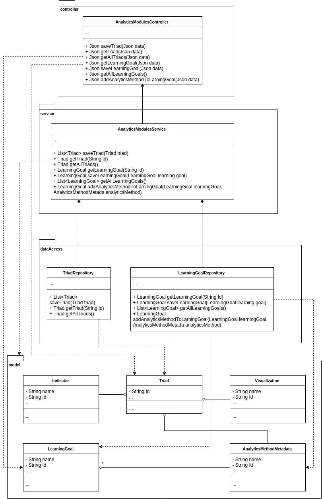
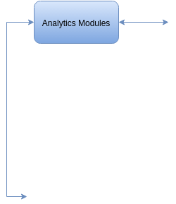

# ANALYTICS MODULES: MODULE VIEWS

## Primary Presentation

## Element Catalog

### Package: controller
* **AnalyticsModulesController:** This controller exposes the `Triad` as well as the `AnalyticsGoal` management methods through a RESTful API for HTTP.

### Package: service
* **AnalyticsModulesService:** The service enables the Analytics Method macro component to manage the `Triad` objects as well as the `AnalyticsGoal` objects. It exposes its functionalities through the `AnalyticsMethodsController`. When saving `Triad` entities, it verifies that they do not already exist. The `Triad` objects do not vaidate the saved configurations. This means that validation must be performed before storing the `Triad`.

### Package: dataAccess
* **TriadRepository:** A data access repository to handle database interaction and load the model of the `Triad` objects and it's related entities.
* **AnalyticsGoalRepository:** A data access repository to handle the database interaction in order to manage the Analytics Goal entities and its related Analytics Methods.

### Package: model
* **Triad:** Triads represent groupings of Indicator, Analytics Methods and Visualizations. In this case, it only requires the references to the IDs of those elements. Additionally, the Triads store the `OLAPPortConfigurations` between both the Indicator output to the Analytics Method input and the Analytics Method output to Visualization Input.
* **IndicatorReferene:** The Indicator (specifically its ID in the `IndicatorEngine`) associated with the particular `Triad`.
* **AnalyticsMethodMetadata::** The AnalyticsMethodMetadata (specifically its ID in the `AnalyticsMethods` macro component) associated with the particular `Triad`.
* **VisualizationReference:** This model object holds the data for referencing a Visualization from the Visualizer macro-component.
* **AnalyticsGoal:** The Analytics Goal represents an arbitrary defined Analytics Goal that is created by the Users of type Teacher. The Analytics Goal correlates multiple Analytics Methods to itself and is used to make suggestions to the user when creating the Triad.

## Context Diagram

## Variability Guide

* Any General User can submit new Analytics Goals requests through the API. In order for Analytics Methods to be correlated with Analytics Goals, a user of type Administrator must activate (or authorize) the requested Analytics Goal. Once the Analytics Goal is active, it can be correlated with Analytics Methods. The `OpenLAPWebClient` should provide views for the submission of the new Analytics Goals as well as for activating them and correlating with existing Analytics Methods.
* The saving of new `Triad` objects are done through the Analytics Engine macro component. Ideally it is done only through that component since the Analytics Methods macro component does not verify the correctness of any configuration of the compatibility between the components of the `Triad`.

## Rationale

The Analytics Methods macro component aims to be a simple referencing mechanism for making suggestions and gaining quick access for stored Triads. The Triads are stored as they are and the compatibility (the configuration of the triad) of the Indicator, Analytics Method and Visualization are not verified, since the task of doing so is done by the Analytics Engine macro component. The saving methods for storing `Triad` entities are designed to be used by the Analytics Engine alone. Methods for viewing the `Triad` objects can be made available to other requests sources that are not necessary the Analytics Engine.

Additionally, the Analytics Methods allow the Users to create Analytics Goals. The Analytics Goals are entities that describe an arbitrary analysis goal such as personalization, comparison, etc. An Analytics Goal can aggregate Analytics Methods once it has been activated. The correlation between Analytics Goal and Analytics Methods are then saved and shown as suggestions during the creation of a `Triad`.

## Related Views
* Section 4.6.2. describes the Component and Connector views for this macro module.
* Section 4.3. explains the Indicator Engine
* Section 4.5. explains the Analytics Methods
* Section 4.4. explains the Visualizer
* Section 4.2. explains the Analytics Engine
